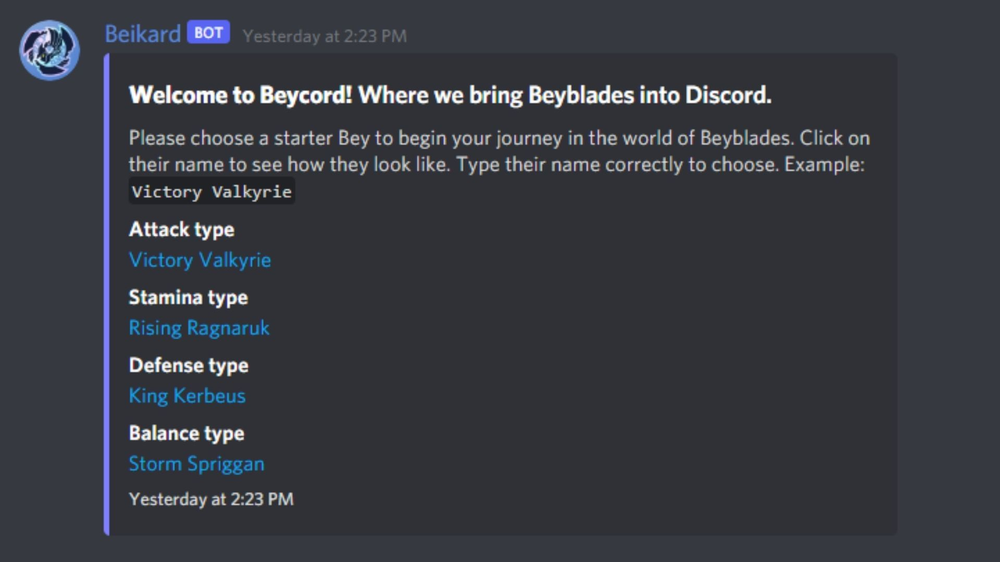

# Getting started with Beycord


You can add the bot to a server if you are a server owner or moderator by inviting it via [this link](https://discord.com/channels/827027426412331048/827033583872245780/858394316065865730) or from top.gg.


## How to start the game

To get started with beycord and all its glory, simply enter the command below.

```text
;start
```

Make sure you're using the proper prefix. `;prefix` is a command that displays the prefix for Beycord in that particular server.

Once you enter the command, Beycord will respond with the following:



Simply enter your desired beyblade \(Victory Valkyrie, Rising Ragnarok, King Kerbeus, or Storm Spriggan\), and don't include the prefix. **Make sure to spell it correctly!**

You're good to go! You started the game, and you're ready to become only the strongest blader yet. I believe in you! Here is a list of commands and their functionality, as well as their usage to begin battling it out.

